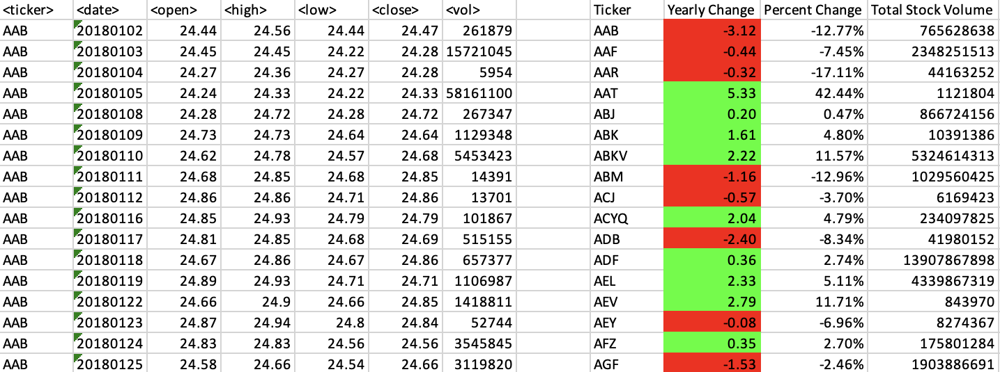

# VBA-Challenge

Module 2 Challenge

## Background

You are well on your way to becoming a programmer and Excel expert! In this homework assignment, you will use VBA scripting to analyze generated stock market data.

### Stock market analysis

## Instructions

- Create a script that loops through all the stocks for one year and outputs the following information:

- The ticker symbol

- Yearly change from the opening price at the beginning of a given year to the closing price at the end of that year.

- The percentage change from the opening price at the beginning of a given year to the closing price at the end of that year.

- The total stock volume of the stock.

- The result should match the following image:

### CHALLENGES

1. Add functionality to your script to return the stock with the "Greatest % increase", "Greatest % decrease", and "Greatest total volume". The solution should match the following image:

2. Make the appropriate adjustments to your VBA script to enable it to run on every worksheet (that is, every year) at once.

### Other Considerations

- Use the sheet `alphabetical_testing.xlsx` while developing your code. This dataset is smaller and will allow you to test faster. Your code should run on this file in under 3 to 5 minutes.

- Make sure that the script acts the same on every sheet. The joy of VBA is that it takes the tediousness out of repetitive tasks with the click of a button.
